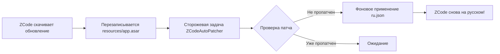

# Русификатор ZCode (Z.ai / ChatGLM Desktop) 🇷🇺

[](https://github.com/nitromir/zcode-ru)
[](https://github.com/nitromir/zcode-ru/releases)
[](https://opensource.org/licenses/MIT)
[](https://youtu.be/TYX-9iIvH2U)

Автоматический русификатор для IDE/ассистента **ZCode** с графическим инсталлятором, чистой базой английского языка (без остатков китайских иероглифов) и **пожизненной защитой от слёта при обновлениях программы и перезагрузке Windows**.

Протестировано и стабильно работает на **Windows 10 / 11 x64**.

---

## 📺 Видео демонстрации работы

Посмотрите краткое видео с демонстрацией установки, автозащиты и работы русифицированного ZCode:

[](https://youtu.be/TYX-9iIvH2U)

> 🔗 **Ссылка на видео:** [https://youtu.be/TYX-9iIvH2U](https://youtu.be/TYX-9iIvH2U)

---

## ✨ Ключевые особенности

- 🎯 **База перевода `en-US` (100% без китайского):** Русификатор внедряется в английскую локаль. Все 5036+ ключей интерфейса переведены на русский язык, а любые системные fallback-сообщения Electron и системные логи выводятся на английском, исключая любые китайские иероглифы.
- 🛡️ **Автоматическая защита от слёта при обновлениях:** Инсталлятор регистрирует сторожевую службу в Планировщике задач Windows (`ZCodeAutoPatcher`). При автоматическом обновлении ZCode русификатор **автоматически накладывается заново в фоновом режиме**.
- 🖥️ **Автономный графический инсталлятор (EXE):** Простой и понятный интерфейс с автоопределением папки ZCode и кнопкой «Обзор...» для выбора нестандартного пути установки.
- ⚡ **Полная обратимость:** Возможность в один клик восстановить оригинальный файл `app.asar.original` и вернуть стандартный интерфейс.
- ⚙️ **Готовая интеграция провайдеров:** В комплект входит справочный конфиг `providers.config.example.json` для подключения кастомных OpenAI-compatible API (tokenrouter, Z.ai, BigModel).

---

## 📥 Быстрая установка

### Вариант 1: Через графический инсталлятор (Рекомендуется)

1. Перейдите в раздел **[Releases](https://github.com/nitromir/zcode-ru/releases)** и скачайте **`ZCode-RU-Setup.exe`**.
2. Запустите инсталлятор от имени Администратора.
3. Инсталлятор автоматически определит путь к ZCode (например, `C:\Program Files\ZCode` или `%LOCALAPPDATA%\Programs\ZCode`). Если программа установлена в другую папку — нажмите **«Обзор...»**.
4. Убедитесь, что отмечена галочка *«Автоматически восстанавливать русификацию при обновлениях ZCode»*.
5. Нажмите кнопку **«✔ Установить русификатор»**.
6. Нажмите **«🚀 Запустить ZCode»**.

---

### Вариант 2: Через PowerShell (Консольный режим)

1. Клонируйте репозиторий или скачайте архив из раздела Releases:
   ```powershell
   git clone https://github.com/nitromir/zcode-ru.git
   cd zcode-ru
   ```
2. Запустите скрипт установки от имени Администратора:
   ```powershell
   powershell.exe -NoProfile -ExecutionPolicy Bypass -File .\patch-zcode-language.ps1
   ```
3. Для указания нестандартной папки:
   ```powershell
   powershell.exe -NoProfile -ExecutionPolicy Bypass -File .\patch-zcode-language.ps1 -InstallDir "D:\Apps\ZCode"
   ```

---

## 🤖 Как устроена автозащита при обновлениях



1. **Планировщик задач Windows:** Регистрируется скрытая системная задача `ZCodeAutoPatcher` с триггерами:
   - При входе любого пользователя в систему (`AtLogOn`).
   - Каждые 15 минут в фоновом режиме (`MSFT_TaskTimeTrigger`).
2. **Фоновый скрипт `zcode-autopatch.ps1`:** Проверяет заголовок `IntlProvider` в `app.asar`. Если файл был перезаписан апдейтером — распаковывает, применяет русификатор и запаковывает обратно за 1-2 секунды.
3. **Логирование:** Результаты автопроверок записываются в `%USERPROFILE%\.zcode\v2\logs\autopatch.log`.

---

## 🛠️ Команды управления и тихий режим

Инсталлятор поддерживает ключи командной строки для автоматизации:

```cmd
:: Тихая установка с автоматическим обнаружением
ZCode-RU-Setup.exe /silent

:: Тихая установка в заданный каталог
ZCode-RU-Setup.exe /silent /dir="D:\Custom\ZCode"

:: Проверка текущего статуса русификации (код возврата 0 = установлен)
ZCode-RU-Setup.exe /check

:: Откат к оригинальной версии программы
ZCode-RU-Setup.exe /revert
```

Через PowerShell:
```powershell
.\patch-zcode-language.ps1 -Check                 # Проверить статус
.\patch-zcode-language.ps1 -Revert                # Откатить app.asar
.\patch-zcode-language.ps1 -InstallAutoPatch      # Переустановить задание в Планировщике
.\patch-zcode-language.ps1 -UninstallAutoPatch    # Удалить задание из Планировщика
```

---

## 🔨 Сборка инсталлятора из исходников

Для самостоятельной сборки `ZCode-RU-Setup.exe` на Windows (требуются только Node.js 18+ и 7-Zip):

```powershell
cd src
powershell.exe -ExecutionPolicy Bypass -File .\build.ps1
```

Скрипт автоматически упакует словарь, зависимости `@electron/asar`, скрипты и скомпилирует `bin\ZCode-RU-Setup.exe` встроенным компилятором `csc.exe` (.NET Framework 4.5+).

---

## 📄 Лицензия

Распространяется под лицензией [MIT](LICENSE).
